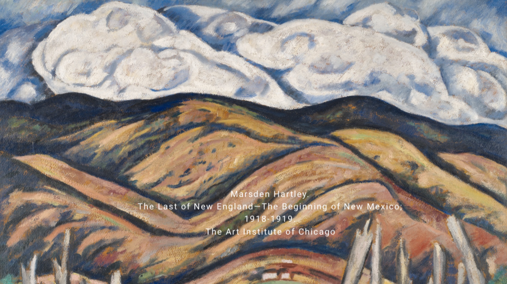

# MetaARTW : Evaluating Metacognition Through ARTWork



> Writeup: [Some LLMs can't identify paintings & they don't know it](https://www.kaggle.com/competitions/kaggle-measuring-agi/writeups/new-writeup-1775005195103)


## Problem statement

In the history of Art, it is well known that Impressionism was rejected in the 19th century. Why? Because people did not realize that painting could be more. Fortunately, the Impressionists knew that they knew painting could be more, and thus defended their point of view. Without that, the painting above might have never seen the light of day.

In the history of Medicine, another well-known, even more disastrous situation occurred in the 19th century as well: Semmelweis demonstrated concretely the importance of handwashing in medicine to prevent unnecessary deaths due to infection. His colleagues ridiculed and rejected him — all because they didn't know that they didn't know.

In everyday life, our ideas (or who we are as people) can be rejected and mocked for the same reasons: they didn't know that they didn't know. This illustrates the importance of knowing what we know, in order to better defend it (and ourselves), as well as the danger of not knowing what we don't — hence the importance of being aware of our own biases. Because this awareness could allow us to see all the other possibilities that exist and have been rejected, as well as the possibilities that exist but that we don't even think of. This might be a step towards a world that accepts us as we are.

**Metacognition** — the ability to accurately self-assess one's own confidence — is a foundational AGI capability. This benchmark tests the metacognition of five models: Claude Opus 4.6, Claude Sonnet 4.6, Gemini 2.5 Pro, Gemini 2.5 Flash, and GPT-5.4.

The strategy is simple: ask each model to reason toward a precise answer that can be very hard to get 100% right, and to self-assess its own confidence. There is an **easy** setting and a **difficult** (ticklish & noisy) setting. For each setting there is a version **without** and **with guidance** (a more explicit prompt), and a version **without** and **with feedback** (adaptive, to check auto-evaluation and calibration adjustment). The strategy generalizes to other domains, here it's applied to paintings.

We observe that some models cannot even identify a painting by an artist whose signature is visible on the canvas, and they don't know that they don't know it. We learn more about the different behaviors of models (variable score gaps), especially when exposed to feedback or more explicit guidance, in the [Results](#results-insights-and-conclusions) section.

## Task & benchmark construction

MetaARTW produces **six comparable leaderboard scores per model** (easy/difficult × static-without-guidance/static-with-guidance/adaptive), enabling analysis along three axes: raw competence, calibration quality, and ability to learn from feedback.

Paintings are an ideal test bed because:
- Ground truth is unambiguous (museum catalogues are authoritative)
- Visual cues for identification are rich (brushwork, palette, signature)
- Difficulty can be controlled (from iconic Monets to obscure regionalists)
- Adversarial noise can be added in principled ways (fake signatures, mirror flips) to unlock endless "ticklishness"

For each image, the model is prompted to respond in a strict format:

```
REASONING: <visual analysis>
ARTIST: <first and last name>
DATE: <year or year range>
CONFIDENCE: <integer 0-100>
```

Parsing is robust to common markdown artifacts (`**bold**`, `<think>...</think>` traces) and accepts multiple canonical name variants per artist (e.g. "James McNeill Whistler", "J. A. M. Whistler", etc.).

## Scoring formula

Per image:

```
final_score = (0.5 × correctness + 0.5 × inverted_brier) × (0.5 + 0.5 × judge_score)
```

Where:
- **correctness** ∈ {0.0, 0.5, 1.0} — graded: both wrong / artist only / full match. For "intruder" images in the difficult set, correctness is always `0.0`.
- **inverted_brier** = `1 − (confidence/100 − correctness)²` — calibration.
- **judge_score** ∈ [0, 1] — three-criterion evaluation by an LLM judge (specific visual reasoning, confidence coherent with that reasoning, honest acknowledgment of uncertainty).

The 50/50 blend between correctness and calibration is deliberate and is the central methodological contribution. A pure Brier score rewards defensive, uniformly-low confidence; pure accuracy ignores metacognition entirely. The blend forces a model to demonstrate both competence *and* self-awareness — metacognition without underlying knowledge is trivial (any model can admit total ignorance).

- A model that answers "20% confidence" on everything (defensive strategy) scores **~0.50**.
- A model that is fully correct and confident (90%) on every painting scores **~0.95**: competence + calibration.

Each response is also tagged with a metacognitive profile based on the gap between confidence and correctness (threshold 0.4): `WELL_CALIBRATED`, `OVERCONFIDENT`, or `UNDERCONFIDENT`.

## Dataset

All images are royalty-free, sourced from the [Art Institute of Chicago](https://www.artic.edu/collection?is_public_domain=1) and the [Paris Musées open content collections](https://www.parismuseescollections.paris.fr/fr/recherche/type/oeuvre/image-libre/1?limit=50&sort=score).

- 30 paintings, 22 unique artists (8 appear twice)
- 11 unique very well-known artists — i.e. 50% of the artists are Monet, Matisse, Van Gogh, etc.
- 30% of the paintings are signed with the artist's name
- The same 30 paintings appear in both the easy and difficult datasets — the difficult versions have ticklish alterations (blurring, fake stains, apocryphal signatures, etc.) but remain recognizable
- Spans multiple eras (Renaissance to early 20th century) and styles (Impressionism, Fauvism, Expressionism, Orientalist, Cubism)

Adversarial perturbations used in the difficult set: apocryphal signatures, blurring, crop/rotation/zoom/mirror flip, black-and-white filtering, watermarks, black stains/occlusions, and "intruder" images that aren't the painting they claim to be.

More details on each painting and its source link are available in the `easy` and `difficult` dataset descriptions (see [Data](#data)).

## Tasks

| Task | Notebook | Difficulty | Guidance | Feedback |
|---|---|---|---|---|
| `MetaARTW static easy-1` | [`notebooks/static_easy_1.ipynb`](notebooks/static_easy_1.ipynb) | Easy | No | No |
| `MetaARTW static easy-2` | [`notebooks/static_easy_2.ipynb`](notebooks/static_easy_2.ipynb) | Easy | Yes (explicit calibration guidance in prompt) | No |
| `MetaARTW static difficult-1` | [`notebooks/static_difficult_1.ipynb`](notebooks/static_difficult_1.ipynb) | Difficult (adversarial) | No | No |
| `MetaARTW static difficult-2` | [`notebooks/static_difficult_2.ipynb`](notebooks/static_difficult_2.ipynb) | Difficult (adversarial) | Yes | No |
| `MetaARTW adaptative easy-1` | [`notebooks/adaptative_easy_1.ipynb`](notebooks/adaptative_easy_1.ipynb) | Easy | No | Yes |
| `MetaARTW adaptative difficult-1` | [`notebooks/adaptative_difficult_1.ipynb`](notebooks/adaptative_difficult_1.ipynb) | Difficult (adversarial) | No | Yes |

**Adaptive setting:** the model sees paintings sequentially with feedback after each one. Sessions are chunked (9 paintings per chunk for Claude Opus, due to tighter context limits; 15 for Claude Sonnet and GPT) with a short performance summary between chunks so the model retains its track record.

## Technical details

Built on the competition's `kaggle_benchmarks` SDK (`kbench`). Images are loaded via `images.from_path(path)` and passed through `llm.prompt()`. Each task is defined with `@kbench.task(name=...)` and run via `.run(kbench.llm)`.

Three metrics are reported per run:
- Average accuracy across N questions
- Average inverted Brier score across N questions
- Average metacognition (final) score across N questions

Inverted Brier score and accuracy are printed for diagnostic analysis. The metacognitive profile associated with each image (`OVERCONFIDENT` / `WELL_CALIBRATED` / `UNDERCONFIDENT`) is also printed. All runs stayed within the given compute budget.

## Results, insights, and conclusions

Mean scores across all six tasks:

| | Claude Opus 4.6 | Claude Sonnet 4.6 | GPT-5.4 | Gemini 2.5 Pro | Gemini 2.5 Flash |
|---|---|---|---|---|---|
| **Mean final score** | 0.70 | 0.59 | 0.38 | 0.32 | 0.20 |
| **Mean accuracy** | 0.54 | 0.35 | 0.16 | 0.33 | 0.18 |
| **Mean inverted Brier score** | 0.90 | 0.86 | 0.67 | 0.42 | 0.31 |

Full per-task raw results: [`results/leaderboard.csv`](results/leaderboard.csv).

<details>
<summary>Per-task final score breakdown (0–1)</summary>

| Model | static easy-1 | static easy-2 | static difficult-1 | static difficult-2 | adaptative easy-1 | adaptative difficult-1 |
|---|---|---|---|---|---|---|
| claude-opus-4-6-default | 0.786 | 0.811 | 0.597 | 0.621 | 0.777 | 0.605 |
| claude-sonnet-4-6-default | 0.653 | 0.679 | 0.527 | 0.520 | 0.651 | 0.514 |
| gpt-5.4-2026-03-05 | 0.341 | 0.501 | 0.278 | 0.445 | 0.405 | 0.331 |
| gemini-2.5-pro | 0.389 | 0.437 | 0.220 | 0.244 | 0.432 | 0.217 |
| gemini-2.5-flash | 0.250 | 0.248 | 0.120 | 0.151 | 0.299 | 0.151 |

</details>

**Some frontier models are bad at identifying artist + date of paintings, and they don't know it.** Very surprisingly, Claude Opus 4.6 is the only frontier model that manages to rightly identify the most paintings while also knowing when it doesn't know — it has both the best calibration (inverted Brier score) and the highest accuracy, hence the highest final score. GPT-5.4 and Gemini 2.5 Flash can barely identify any paintings despite 30% of the paintings having a signature and 50% of the artists being popular — and they don't know it. They are overconfident on wrong answers, and don't learn much from their mistakes when feedback is provided or when the prompt becomes more explicit about what it expects. GPT-5.4 is the more decent one of the two.

**LLMs can also be underconfident.** It is well known that LLMs tend to be overconfident (and invent plausible-sounding attributions), but per-image metacognitive profiles reveal that Claude Opus 4.6 and Claude Sonnet 4.6 can also be underconfident.

**Signatures matter.** Models that successfully read an on-canvas signature jump to high-confidence correct answers. On the other hand, they can fall for a misleading signature that a human would have been suspicious of, simply because of how fake it looks.

**Metacognition and competence can diverge — but metacognition can also help become more competent.** In the ticklish, noisy set, accuracy drops by nearly half; the Claude models even tell themselves they don't know the answers, even though they do. They're all too intimidated by the distractions and don't bother looking for the correct answers they actually have. If the models were more self-aware about this, it might boost them into getting the correct answers.

**Auto-evaluation & adjustment.** Feedback has an even smaller effect than guidance, and a smaller effect than one might have expected: the models could have realized they were placing too much emphasis on noise and refocused on the essentials (learning and attention). We could also have been trickier — in real life, feedback isn't always correct; it can be intentionally or unintentionally misleading. Being able to read the intention behind it (social cognition) and adapt (executive functions) brings us back to the other faculties considered necessary for AGI: metacognition seems to need them too.

**Limitations.** Sample size (30 paintings × 6 variants), due to budget and time constraints, is modest for per-bin statistical tests like ECE — which is why we use aggregate Brier score rather than bucketized ECE. The judge LLM also introduces some noise into the score: judged criteria are stable across runs but not deterministic. Future work could expand to 1,000+ paintings using museum website APIs and add a deterministic judge fallback.

## Repository structure

```
.
├── LICENSE                    # MIT (code/notebooks)
├── assets/
│   └── cover.png            # Cover image (Marsden Hartley, easy set)
├── notebooks/                # Kaggle kernels, one per task
│   ├── static_easy_1.ipynb
│   ├── static_easy_2.ipynb
│   ├── static_difficult_1.ipynb
│   ├── static_difficult_2.ipynb
│   ├── adaptative_easy_1.ipynb
│   └── adaptative_difficult_1.ipynb
├── results/
│   └── leaderboard.csv       # Raw leaderboard export
└── data/
    ├── easy/                 # Clean painting images (not tracked in git — see below)
    └── difficult/             # Adversarially altered painting images (not tracked in git)
```

## Running the notebooks

These notebooks were built as **Kaggle kernels** for the "Measuring Progress Toward AGI" competition and depend on the competition's `kaggle_benchmarks` package (`kbench`) and its `%choose` kernel magic to select which task to run. They expect images at `/kaggle/input/datasets/aaaaak/painting-images-easy/...` and `.../painting-images-difficult/...`. To run them outside Kaggle you'll need to adapt the image paths and provide your own `kaggle_benchmarks` environment plus LLM + judge-LLM credentials.

## Data

The `data/easy` and `data/difficult` image folders aren't included in this repo (add your local copies there if you want to run the notebooks). This is safe to publish: both source institutions release these images under [Creative Commons Zero (CC0)](https://creativecommons.org/publicdomain/zero/1.0/) — free reuse and redistribution, including commercial use, with no permission required ([Art Institute of Chicago open access terms](https://www.artic.edu/image-licensing), [Paris Musées Open Content](https://www.parismuseescollections.paris.fr/fr/les-images-sous-droits)). Only images explicitly labeled CC0 / public domain on those sites qualify, so double-check that's the case for any painting you add. Both institutions request (not require) a caption in the form `Artist. Title, Date. Institution.`

## Organizational affiliations

Independent submission.

## References & citations

- Morris, M. R., et al. (2023). *Measuring Progress Toward AGI: A Cognitive Framework.* Google DeepMind. — Framework for defining and measuring levels of Artificial General Intelligence.
- Brier, G. W. (1950). *Verification of Forecasts Expressed in Terms of Probability.* Monthly Weather Review. — Foundation of the scoring rule used in the calibration component.
- [The Art Institute of Chicago Open Access Collection](https://www.artic.edu/collection?is_public_domain=1) — image provenance.
- [Paris Musées Open Content](https://www.parismuseescollections.paris.fr/fr/recherche/type/oeuvre/image-libre/1?limit=50&sort=score) — image provenance.

## License

Code and notebooks in this repo are released under the [MIT License](LICENSE). The painting images (if you add them under `data/`) are CC0 from their respective museums — see [Data](#data) above; they aren't covered by the MIT license since they aren't this project's own creative work.
